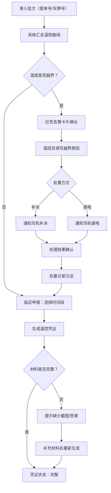

## 1. 产品概述

跨境冷链通关温控 Web 控制台，面向报关行与冷链运营中心值班员，聚焦"申报前温度材料准备"和"通关中异常盯控"两大核心场景，帮助用户高效录入在途批次信息、自动汇总温度曲线、一键生成海关温控凭证、实时处置越界异常，形成从入仓到放行的全链路温控可追溯闭环。

## 2. 核心功能

### 2.1 用户角色

| 角色 | 使用场景 | 核心权限 |
|------|----------|----------|
| 报关行操作员 | 申报前材料准备、凭证生成 | 录入批次、生成凭证、查看温控曲线 |
| 冷链值班员 | 通关中异常盯控、处置记录 | 越界告警确认、填写处置原因、通知司机操作 |

### 2.2 功能模块

1. **在途批次模块**：按提单号或车牌号录入批次，展示实时温控曲线与批次状态卡片
2. **温控凭证模块**：申报前选择时间段自动生成温控凭证，提示缺失材料
3. **处置记录模块**：温度越界时红色告警卡片，值班员填写处置原因与操作，形成可追溯记录

### 2.3 页面详情

| 页面名称 | 模块名称 | 功能描述 |
|----------|----------|----------|
| 控制台首页 | 在途批次列表 | 按提单号/车牌号搜索筛选，展示批次卡片（状态、品类、温区、到港时间），红色卡片标识越界批次，支持新增批次弹窗 |
| 控制台首页 | 温控曲线面板 | 点击批次卡片展开温度曲线图（车载温度计 + 箱内记录仪 + 开门记录三线叠加），显示允许温区上下限虚线 |
| 控制台首页 | 批次录入弹窗 | 表单字段：提单号、车牌号、货物品类、启运地、目的口岸、允许温区（上限/下限）、预计到港时间 |
| 控制台首页 | 越界告警浮层 | 温度越界时弹出红色告警卡片，显示批次号、越界时段、越界温度值，操作按钮：填写原因、通知司机补冰、通知司机接电 |
| 温控凭证页 | 时间段选择器 | 选择海关要求的起止时间段，预览该时段温度曲线截取 |
| 温控凭证页 | 凭证预览与生成 | 自动整理最高温、最低温、超限分钟数、传感器编号，提示缺少的截图或签章，一键生成凭证文档 |
| 温控凭证页 | 凭证列表 | 已生成凭证历史列表，显示批次号、生成时间、状态（完整/待补材料） |
| 处置记录页 | 处置流水表 | 按时间倒序展示所有处置记录，支持按批次号、处置类型、时间范围筛选 |
| 处置记录页 | 处置详情 | 展示单条处置完整链路：越界时间 → 值班员原因填写 → 通知司机操作 → 处理结果确认 |

## 3. 核心流程

**主流程**：操作员录入批次 → 系统汇总温控曲线 → 申报前生成凭证 → 通关中异常处置 → 处置记录沉淀

## 4. 用户界面设计

### 4.1 设计风格

- **主色调**：深蓝灰 (#1A2332) 为底，冷链蓝 (#0EA5E9) 为主强调色，告警红 (#EF4444) 为越界提示色
- **次色调**：冰蓝 (#BAE6FD) 用于温区背景，薄荷绿 (#34D399) 用于正常状态标识
- **按钮风格**：圆角微立体，主操作蓝色实心，危险操作红色描边，次要操作灰色幽灵按钮
- **字体**：标题使用 DM Sans（粗体），正文使用 Noto Sans SC，数据/数字使用 JetBrains Mono
- **布局风格**：左侧导航栏 + 主内容区卡片布局，顶部状态概览条
- **图标风格**：线性图标（Lucide 风格），冷链主题定制（温度计、集装箱、冰晶）

### 4.2 页面设计概览

| 页面名称 | 模块名称 | UI 元素 |
|----------|----------|----------|
| 控制台首页 | 顶部概览条 | 深色背景，4 个统计卡片（在途批次数、越界告警数、待生成凭证、今日处置数），数字用 JetBrains Mono 大号显示 |
| 控制台首页 | 在途批次列表 | 卡片网格布局，每张卡片显示批次号、品类图标、温度实时值、状态徽章，越界卡片红色边框 + 脉冲动画 |
| 控制台首页 | 温控曲线面板 | 右侧滑出面板，Chart.js 三线叠加折线图，允许温区半透明蓝色带，开门事件用竖虚线标注 |
| 控制台首页 | 批次录入弹窗 | 居中模态框，表单分组排列，温区输入用双滑块选择器 |
| 控制台首页 | 越界告警浮层 | 右下角固定浮层，红色渐变背景，脉冲呼吸动画，处置按钮横排 |
| 温控凭证页 | 时间段选择器 | 日期范围选择器 + 时间滑块，选区在曲线缩略图上高亮 |
| 温控凭证页 | 凭证预览 | A4 仿真纸张预览，盖章区域用虚线框标注缺失签章 |
| 温控凭证页 | 凭证列表 | 表格布局，状态列用彩色圆点标识 |
| 处置记录页 | 处置流水表 | 时间轴式表格，左侧时间轴连线，右侧卡片内容 |
| 处置记录页 | 处置详情 | 步骤条展示处置链路，每步有时间和操作人 |

### 4.3 响应式设计

- 桌面端优先（1440px 基准），侧边导航可折叠
- 平板端（768px-1024px）侧边栏自动收起为图标模式
- 移动端（< 768px）底部标签导航，卡片单列排布

### 4.4 3D 场景

本项目不涉及 3D 场景。
