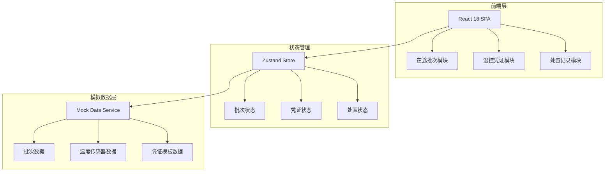
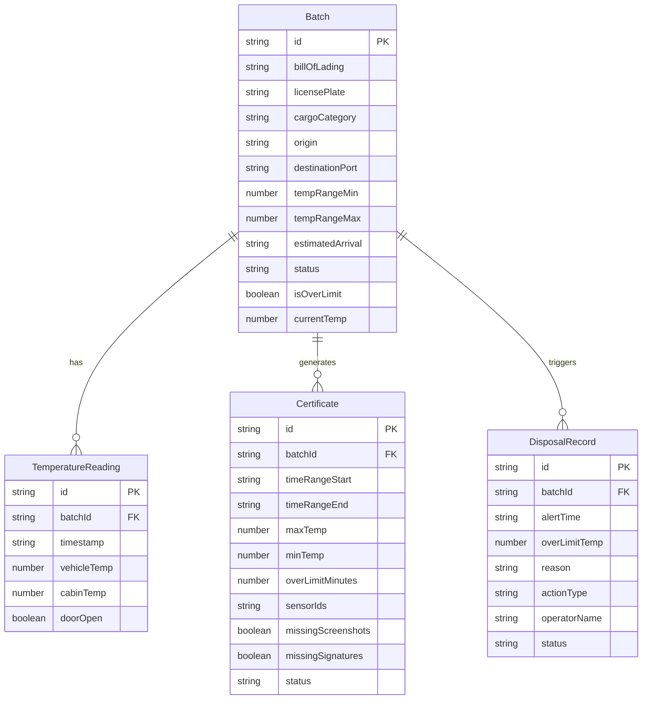

## 1. 架构设计



## 2. 技术说明

- **前端框架**：React 18 + TypeScript
- **样式方案**：Tailwind CSS 3 + CSS Modules（组件级定制）
- **构建工具**：Vite
- **图表库**：Chart.js + react-chartjs-2（温控曲线图）
- **状态管理**：Zustand（轻量全局状态）
- **路由**：React Router v6
- **图标**：Lucide React
- **后端**：无（纯前端 + Mock 数据）
- **数据库**：无（使用内存 + localStorage 持久化）

## 3. 路由定义

| 路由 | 用途 |
|------|------|
| / | 控制台首页 - 在途批次列表与温控曲线 |
| /certificates | 温控凭证管理页 |
| /records | 处置记录查询页 |

## 4. API 定义

本项目为纯前端应用，所有数据通过 Mock Service 层提供：

### 4.1 批次相关

```typescript
interface Batch {
  id: string
  billOfLading: string
  licensePlate: string
  cargoCategory: string
  origin: string
  destinationPort: string
  tempRangeMin: number
  tempRangeMax: number
  estimatedArrival: string
  status: 'in_transit' | 'awaiting_declaration' | 'customs_hold' | 'cleared'
  isOverLimit: boolean
  currentTemp: number
  createdAt: string
}

interface TemperatureReading {
  timestamp: string
  vehicleTemp: number
  cabinTemp: number
  doorOpen: boolean
}

interface TemperatureCurve {
  batchId: string
  readings: TemperatureReading[]
}
```

### 4.2 凭证相关

```typescript
interface Certificate {
  id: string
  batchId: string
  timeRangeStart: string
  timeRangeEnd: string
  maxTemp: number
  minTemp: number
  overLimitMinutes: number
  sensorIds: string[]
  missingScreenshots: boolean
  missingSignatures: boolean
  status: 'complete' | 'pending_materials'
  generatedAt: string
}
```

### 4.3 处置记录相关

```typescript
interface DisposalRecord {
  id: string
  batchId: string
  alertTime: string
  overLimitTemp: number
  overLimitDuration: number
  reason: string
  actionType: 'add_ice' | 'connect_power' | 'other'
  operatorName: string
  notifyDriverAt: string | null
  resolvedAt: string | null
  status: 'pending' | 'notified' | 'resolved'
}
```

## 5. 服务端架构

本项目无后端服务，数据层通过 Mock Service 实现，支持 localStorage 持久化。

## 6. 数据模型

### 6.1 数据模型定义



### 6.2 数据初始化

使用 Mock 数据初始化，包含 8-10 个预设批次、对应的温度传感器时序数据和 3-5 条处置记录示例。
